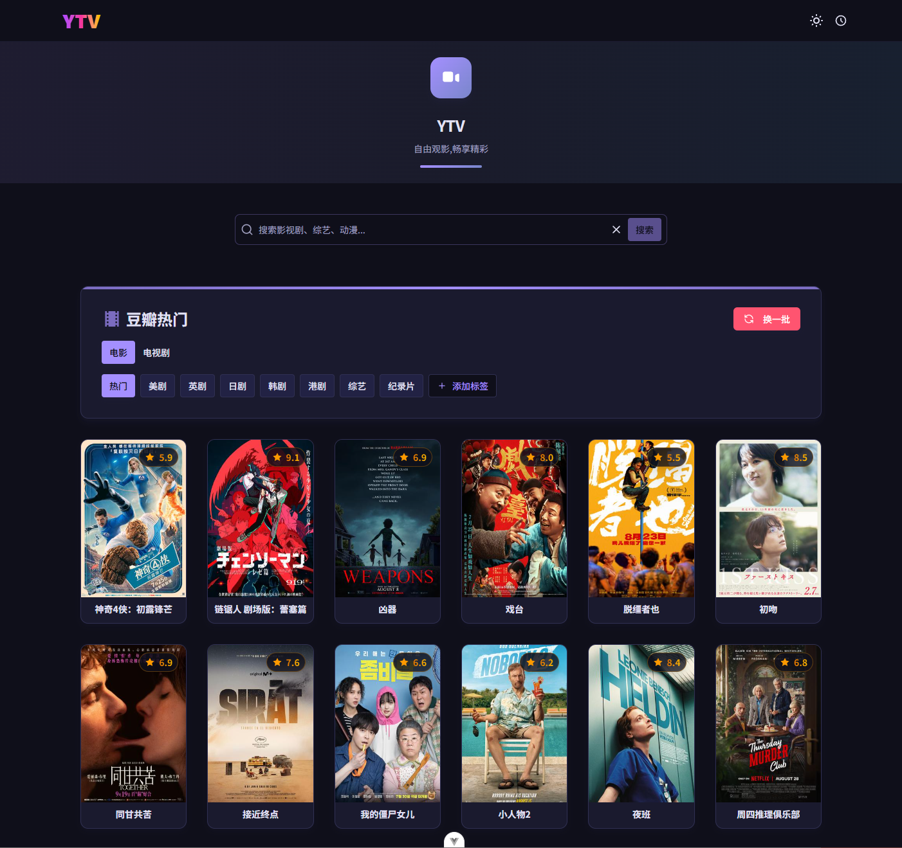
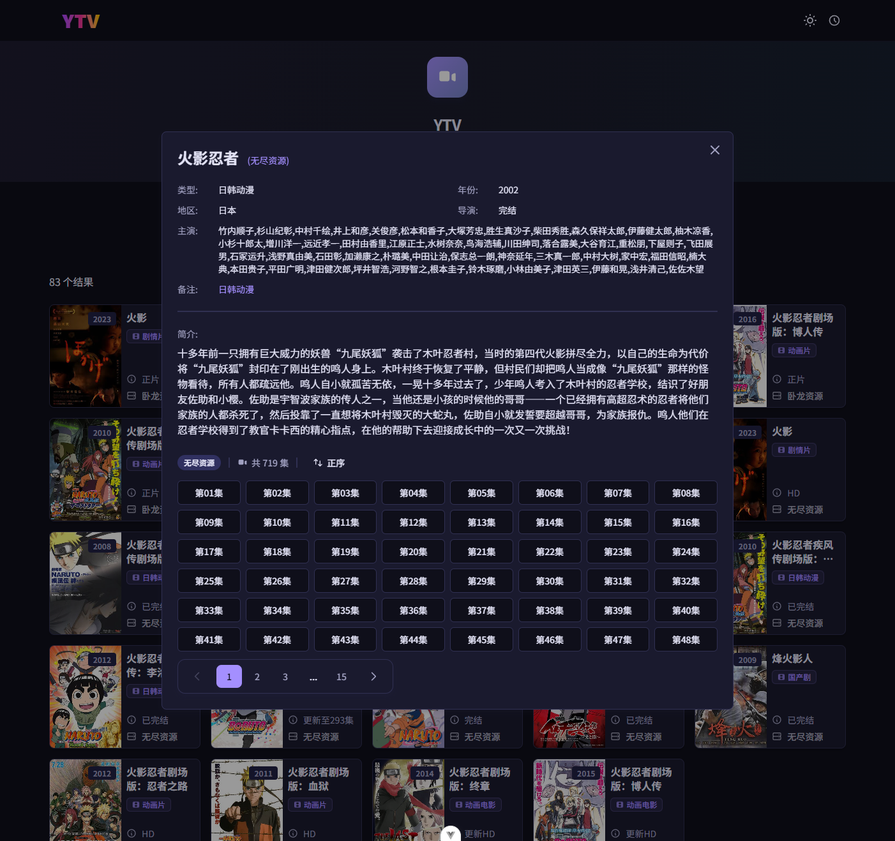
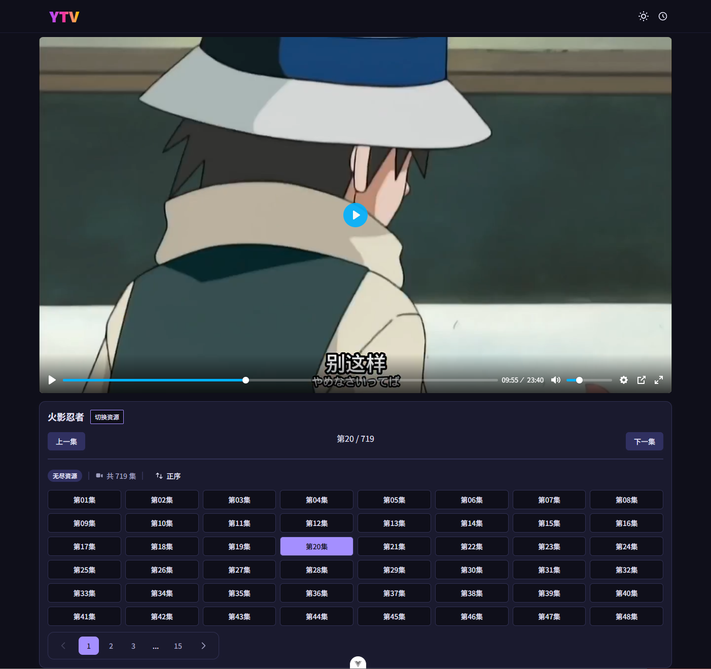
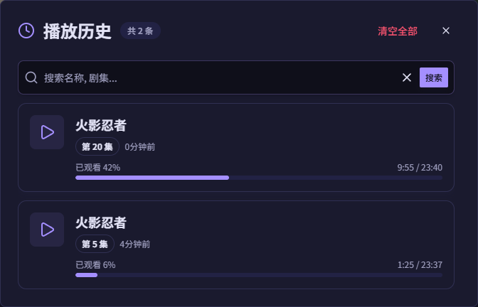

# YTV

🎬 现代化的影视播放网站

基于 Go + Vue 3 构建的高性能视频播放平台


---

## 📖 简介

YTV 是一个现代化的影视播放网站，提供流畅的视频观看体验。本项目最初基于 LibreTV，但由于原项目性能问题和原生开发的局限性，使用 Go + Vue 3 技术栈进行了完全重写，带来了更好的性能和用户体验。

### ✨ 主要特性

- 🚀 **高性能**：Go 后端 + Vue 3 前端，流畅快速
- 🎨 **现代化 UI**：基于 Tailwind CSS 的精美界面设计
- 📱 **响应式设计**：完美适配桌面端和移动端
- 🔍 **智能搜索**：快速查找您想看的影视内容
- 📝 **播放历史**：自动记录观看进度，随时继续观看
- 🎬 **多源支持**：支持多个视频源，确保播放流畅
- 🌙 **深色模式**：支持亮色/暗色主题切换
- 🐳 **Docker 部署**：一键部署，简单快捷

---

## 📸 项目预览

### 首页



### 搜索页面



### 视频播放



### 播放历史



---

## 🚀 快速开始

### 前置要求

- Docker & Docker Compose (推荐)
- 或者：
  - Go 1.21+
  - Node.js 18+
  - pnpm/npm/yarn

### Docker 部署（推荐）

**1. 克隆项目**

```bash
git clone https://github.com/yozya-official/ytv.git
cd ytv
```

**2. 配置 API**

编辑 `data/api.yaml` 文件，配置视频源 API：

```yaml
apis:
  - name: "示例源"
    url: "https://example.com/api"
    enabled: true
  - name: "备用源"
    url: "https://backup.com/api"
    enabled: true
```

**3. 启动服务**

```bash
docker-compose up -d
```

**4. 访问应用**

打开浏览器访问：`http://localhost:9000`

### 本地开发

#### 后端

```bash
go mod tidy
go run main.go
```

后端服务将在 `http://localhost:9000` 启动

#### 前端

```bash
cd frontend
pnpm install
pnpm dev
```

前端服务将在 `http://localhost:5173` 启动

---

## ⚙️ 配置说明

### API 配置

API配置文件位于 `data/api.yaml`：

### 环境变量

创建 `.env` 文件：

```env
# 后端配置
PORT=8080
API_CONFIG_PATH=./data/api.yaml

# 前端配置
VITE_API_BASE_URL=http://localhost:8080
```

---

## 🛠️ 技术栈

### 后端

- **Go** - 高性能后端服务
- **Gin** - Web 框架

### 前端

- **Vue 3** - 渐进式 JavaScript 框架
- **TypeScript** - 类型安全
- **Vite** - 极速构建工具
- **Tailwind CSS** - 实用优先的 CSS 框架
- **Pinia** - 状态管理
- **Vue Router** - 路由管理
- **VueUse** - Vue 组合式工具集

---

## 📁 项目结构

```text
ytv/
├── main.go             # 入口文件
├── models/             # 数据模型
├── service/            # 业务逻辑
├── middleware          # 中间件
└── conf/               # 简易配置
├── frontend/               # Vue 前端
│   ├── src/
│   │   ├── components/     # 组件
│   │   ├── views/          # 页面
│   │   ├── stores/         # 状态管理
│   │   ├── router/         # 路由配置
│   │   └── assets/         # 静态资源
│   ├── public/             # 公共文件
│   └── index.html
├── data/                   # 数据目录
│   └── api.yaml           # API 配置
├── preview/                # 项目预览图片
├── docker-compose.yml      # Docker 编排
├── Dockerfile              # Docker 镜像
```

---

## 🔧 常见问题

### 1. 视频无法播放？

- 检查 API 配置是否正确
- 确认视频源是否可用
- 尝试切换不同的视频源

### 2. Docker 部署失败？

```bash
# 查看日志
docker-compose logs

# 重新构建
docker-compose down
docker-compose build --no-cache
docker-compose up -d
```

### 3. 如何添加新的视频源？

编辑 `data/api.yaml`，添加新的 API 配置并重启服务。

### 4. 播放历史在哪里存储？

播放历史保存在浏览器的 LocalStorage 中，清除浏览器数据会导致历史记录丢失。

---

## 🗺️ 开发计划

- [ ] 暂无

---

## 📄 开源协议

本项目采用 MIT 协议开源，详见 [LICENSE](LICENSE) 文件。

---

## 🙏 致谢

- [LibreTV](https://github.com/LibreSpark/LibreTV) - 项目灵感来源
- 所有为本项目做出贡献的开发者

---

## 📧 联系方式

如有问题或建议，欢迎通过以下方式联系：

- 提交 [Issue](https://github.com/yozya-official/ytv/issues)
- 发送邮件：your.email@example.com

---

**⭐ 如果这个项目对你有帮助，请给个 Star 支持一下！**
